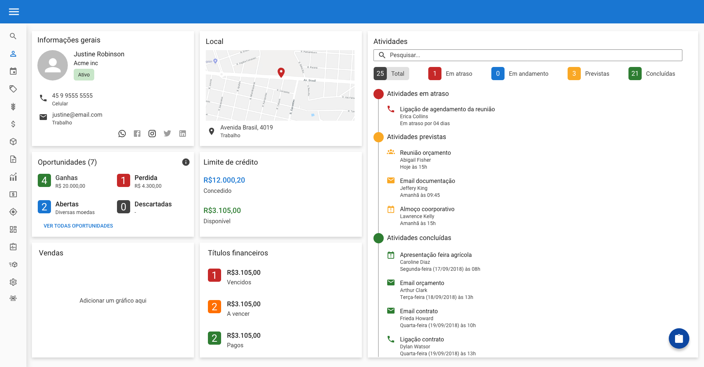

# Wealth Systems Quality Assurance Challenge
Esse desafio tem por objetivo avaliar sua capacidade de analisar cenários de testes e de automatizá-los.
Por se tratar de um desafio para todos os níveis, não se sinta preso em submeter a solução completa, envie o que conseguir fazer junto com suas considerações.
Os desafios devem ser agrupados em um único projeto.

# Desafio

O desafio consiste em:

1. Especificar cenários de testes, baseado em um protótipo;
2. Automatizar o teste front-end de 2 funcionalidades;
3. Automatizar o teste back-end de uma API;

## 1 - Cenários de Testes

Crie cenários de testes baseados no protótipo abaixo. Você está livre para usar o formato que quiser.

## 2 - Automação de 2 funcionalidades front-end

No site abaixo existem duas funcionalidades á serem testadas.

Na primeira, é possível renderizar um elemento escondido.
Crie uma automação que clique no botão “Start”, aguarde pelo carregamento do elemento e faça uma validação que o texto “Hello World!” foi apresentado.
https://the-internet.herokuapp.com/dynamic_loading/1

Na segunda, os seletores dos elementos que você utilizar serão avaliados. Seu desafio é encontrar bons seletores para os elementos.
Crie uma automação que clique nos três botões apresentados em tela e em todos “edit” e “delete” da grid.
https://the-internet.herokuapp.com/challenging_dom

## 3 - Automação de 1 funcionalidade back-end

Crie uma collection de testes que valide o GET, POST, PUT  e DELETE da API disponibilizada no end-point abaixo.
http://jsonplaceholder.typicode.com/users
Valide o JSON schema e http code das respostas.

# Recomendações

Os itens abaixo não são obrigatórios.

- Use Gherkin para descrição dos cenários de testes;
- Para automação das funcionalides front-end, busque usar um framework JavaScript;
- Utilize o Postman para automação da funcionalidade back-end;

# O que vamos avaliar
- A estruturação e escrita dos cenários de testes;
- Os cenários e validações das automações;
- A utilização de padrões de projetos;
- A estruturação do projeto;
- Boas práticas de programação;

# A apresentação do desafio
- Crie um repositório para o projeto em sua conta pessoal no GitHub;
- Crie um README.md com as instruções para a execução do projeto;
- Nos envie o link do repositório via Plataforma GUPY por onde recebeu essas instruções.

